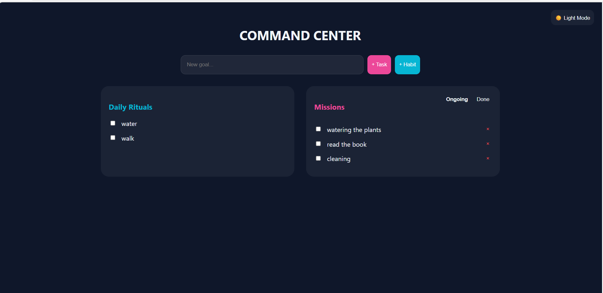
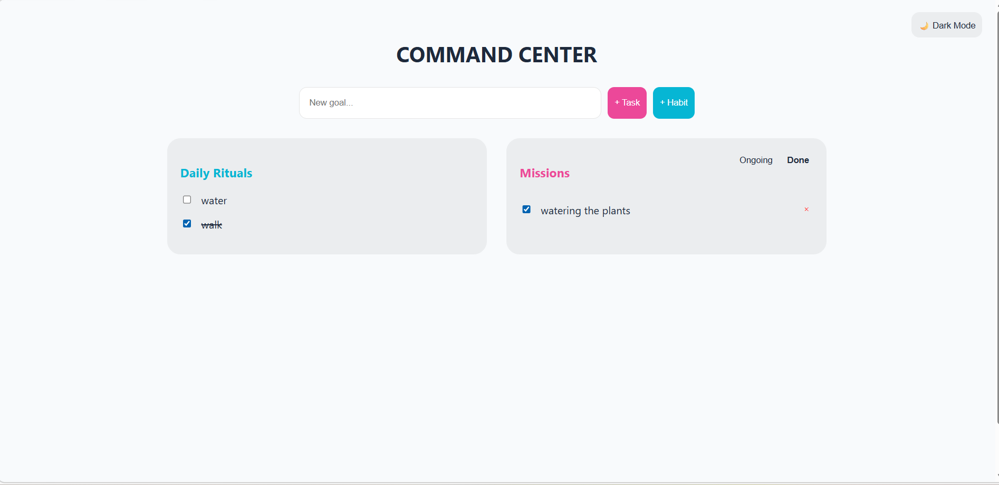

## 📸 Gallery

| Dark Mode (Default) | Light Mode |
|---|---|
|  |  |

---
🚀 Command Center Pro:
Habit & Mission Tracker
Command Center Pro is a high-performance React.js dashboard designed to bridge the gap between daily habit formation and one-time task management. Built with a focus on Glassmorphism UI and State Persistence, this app serves as a centralized hub for personal productivity.

🌟 Key Features
🛠 Dual-Engine Task Management
Unlike standard to-do lists, this app features two distinct logic engines:

Daily Rituals (Habit Tracker): Tasks that automatically reset every 24 hours. Ideal for recurring goals like "Drink 5L Water" or "Exercise."

One-Time Missions (Task Mastery): Standard tasks with "Ongoing" and "Completed" filtering, allowing users to focus on current objectives without losing track of accomplishments.

🌗 Adaptive Theme Engine
Dark/Light Mode: A fully integrated theme toggle that persists across browser sessions using localStorage.

Glassmorphism Design: A modern, frosted-glass aesthetic with dynamic gradients and smooth CSS transitions.

🏆 Tri-Level Motivation System
The app features a "Calculated Property" logic that monitors the state of all tasks to provide real-time encouragement:

Mission Clear: Triggered when all one-time tasks are finished.

Habit Hero: Triggered when all daily rituals are completed.

Grand Master: A special achievement banner when the entire board is cleared.

💾 Smart Persistence & Editing
Auto-Save: Powered by localStorage, ensuring your data remains intact even after a page refresh.

Inline Editing: A seamless UX pattern allowing users to rename missions instantly by clicking the text.

Daily Reset Logic: Uses the JavaScript Date object to compare timestamps and reset habits at midnight.

💻 Tech Stack
Frontend: React.js (Hooks: useState, useEffect)

Styling: Modern CSS-in-JS (Dynamic Object Styles)

Storage: Browser Local Storage API

Deployment: Vercel

🚀 How to Run Locally
Clone the repository:
git clone https://github.com/YOUR_USERNAME/command-center.git

Install dependencies:
npm install

Start the development server:
npm run dev

Why I Built This
This project was developed to master Complex State Management in React. It demonstrates the ability to handle multiple data streams (Habits vs. Tasks) within a single unified state, while maintaining a clean, professional, and accessible User Interface.
